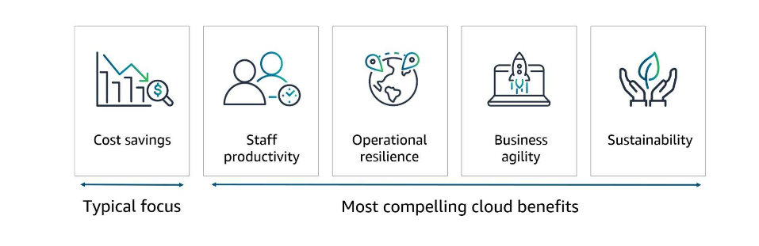

# Cloud Economics

The business value conversation and analysis help you address the financial components that are typically top concerns for potential customers. AWS developed the Cloud Value Framework as a way to think about the value of the cloud. The framework is composed of five pillars: cost savings, staff productivity, operational resilience, business agility, and sustainability. 

Typically, customers focus on cost savings as a primary driver for cloud migration. While cost is important, the four other pillars of the framework generally drive even greater business value for customers and should also be emphasized in your business value customer conversations. 

## Cost Savings
A primary tool for communicating cost savings to your customer is a cost savings analysis. In a cost savings analysis, you calculate the total cost of ownership—that is, the acquisition and operating cost—for running an end-to-end, traditional IT environment on premises, compared with deploying to AWS. 

You use a cost savings analysis when you want to help a customer compare costs and build a business case for transitioning to AWS. Often, the biggest challenge for customers is understanding the true scope of their current costs. A business case helps your customers compare costs as well as build the business case for moving to the cloud.

## Staff Productivity
Staff productivity refers to the efficiency gained from reducing or eliminating tasks no longer needed with cloud services. Tactical, undifferentiated work previously required for traditional data centers, like procuring, setting up, and maintaining hardware, is no longer necessary. This saves staff time and reduces time to innovation.

With AWS, your customers’ resources can move to more strategic work. They adopt new services and technologies, which can result in additional cost reductions and accelerated time to market. IT team members who previously worked on projects like storage array deployments and server refreshes can transition to become DevOps specialists. By being integrated into the dev team, they can support the development of new products and services.

## Operational Resilience
Operationally resilient IT organizations depend on the health of four cornerstones: operations, security, software, and infrastructure. 

1. To mitigate operational disruptions and disaster, AWS leverages automation, manages services from end to end, provides system-wide visibility, supports security and governance configuration, and monitors API access.
2. To reduce software risks, AWS offers blue/green deployments, automates workflows, runs smaller code deployments, provides operating system patching, and creates and manages AWS resource collections.
3. To reduce security risks, AWS helps mitigate security risks, provides identity and access management, and assists with compliance.
4. To reduce infrastructure failures, AWS expands and improves AWS data centers, provides multiple Availability Zones and Regions, provides highly available and durable systems, offers Availability Zones that redundantly connect, and uses two independent power sources for every instance.
   

## Business Agility
Business agility is about delivering more, such as responding faster, experimenting more, and delivering results in the same or less amount of time. It means being able to deliver more value to customers. For example, business agility can promote product development, expansion into new markets, and internal or external stakeholder responsiveness.

Business agility is a broad area of value that primarily addresses customers’ increased opportunities to experiment and respond more quickly to changing business conditions. 

## Sustainability
AWS customers can optimize their consumption of AWS resources for continued reductions in workload carbon footprint with relatively easy things, for example:

- Use the Instance Scheduler on AWS to turn off compute when it will not be used.
- Choose serverless when possible.
- Use instances based on AWS Graviton. It uses up to 60-percent less energy for the same performance than comparable Amazon EC2 instances.
- Use AWS Cost Explorer for right-sizing recommendations of workloads.

# Cloud Financial Management
Cloud financial management includes four key areas: 

- Measurement and accountability focuses on establishing cost transparency and accountability through the necessary steps to ensure visibility into spend.
- Cost optimization focuses on identifying waste, building cloud-friendly architectures that scale based on demand, and improving cost efficiency.
- Planning and forecasting focuses on gaining a better understanding of costs associated with current and future IT needs, which drives more accurate financial and business planning.
- Cloud financial operations focuses on identifying and investing in people, processes, tools, and automation to support cloud financial management.

# Migration Portfolio Assessment
The MPA helps your customers analyze data about their current on-premises IT inventory, and map those resources to AWS services for a simple cost comparison. Customers can then use this data to validate their business case and create migration plans.

They can also use this data to estimate the level of effort and costs associated with migration, as well as estimate the annual run rates for compute and storage resources on AWS. This information often defines the complete dataset required to properly analyze and prioritize application migrations.

