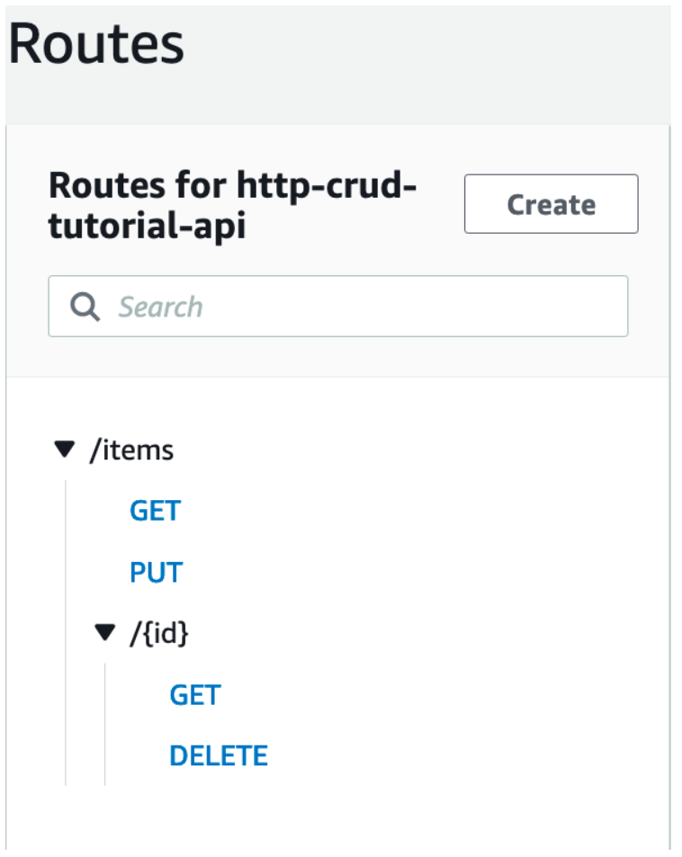

## Workshop Build your first CRUP API in 45 min

[Link Workshop](https://catalog.us-east-1.prod.workshops.aws/workshops/2c8321cb-812c-45a9-927d-206eea3a500f/en-US)

O objetivo do workshop é construir uma CRUD API muito simples (Create, read, update, delete) utilizando serviços AWS como DynamoDB, AWS Lambda e API Gateway

Quando você invoca sua API HTTP, o API Gateway roteia a solicitação para sua função do Lambda. A função do Lambda interage com o DynamoDB e retorna uma resposta ao API Gateway. Em seguida, o API Gateway retorna uma resposta para você.

---
### 1º Passo: DynamoDB

Seguindo para o console do DynamoDB para criar uma tabela será necessário:
- Nome
- Primary Key
  
### 2º Passo: Lambda Function

Seguindo para o console do AWS Lambda criar uma função utilizamos:
- Nome
- Linguagem utilizada para escrever a função. No workshop utilizamos Node.js 16.x para permitir requisições via postman.
- Criamos uma nova role com AWS policy templates fornecendo nome e utilizando Simple Microservice permissions
- O código que compõem a função foi colocado em index.js *(localizado em ./Código/index.js)*
- Finalizamos clicando em Deploy para atualizar a função

### 3º Passo: HTTP API

**Motivação:**

Amazon API Gateway  is a fully managed service that makes it easy for developers to publish, maintain, monitor, secure, and operate APIs at any scale.

With API Gateway, you can create RESTful APIs using either HTTP APIs or REST APIs. Together with AWS Lambda, API Gateway forms the app-facing part of the AWS serverless  infrastructure.

HTTP APIs enable you to create RESTful APIs with lower latency and lower cost than REST APIs. You can use HTTP APIs to send requests to AWS Lambda functions or to any publicly routable HTTP endpoint.

The HTTP API provides an HTTP endpoint for your Lambda function. In this step, you create an empty API. In the following steps, you configure routes and integrations to connect your API and your Lambda function.

Procedimento:
- Acesse o console do API Gateway
- Selecione criar uma HTTP API
- Nome
- Rotas são configuradas no próximo passo
- Criar

### 4º Passo: Rotas

Routes  are a way to send incoming API requests to backend resources. Routes consist of two parts: an HTTP method and a resource path, for example, GET /items. For this example API, we create four routes:

GET /items/{id}

GET /items

PUT /items

DELETE /items/{id}

Procedimento:

- Acesse o console API Gateway
- Selecione a API 
- Selecione Rotas
- Criar
- Para o método selecione o desejado para construir uma das quatro rotas
- Para o Path (caminho) preencha de acordo com os exemplos
- Selecione Criar

### 5º Passo: Integrar

É necessário vincular as rotas criadas aos recursos backend para que possam ser utilizadas

After you attach the integration to all of the API's routes, your Lambda function is invoked when a client calls any of your routes.

Procedimento:
- No console API Gateway selecione a sua API e escolha Integrations
- Manage Integrations -> Criar
- Vincular com rotas é feito em um próximo passo
- Escolha o tipo de integração como Lambda Function
- Selecione a função lambda criada anteriormente

### 6º Passo: Vincular integração às rotas

**Funcionamento**

For this example API, you use the same AWS Lambda integration  for all routes, so in essence a monolithic application. Monoliths work well for the simplest serverless applications that perform single-purpose functions. As those applications evolve into workflows or develop new features, it becomes important to refactor the code into smaller services as described in: Best practices for organizing larger serverless applications 

Procedimento para cada rota:

- No console API Gateway selecione a API e escolha Integrations
- Escolha uma rota e em baixo escolha a integração construida anteiormente

### 7º Passo: Testar API

Seguindo o workshop usariamos o serviço Cloud9, porém é possível utilizar o Postman

Siga o arquivo pdf tutorial em arquivos para testar as rotas

**CLEAN UP**

Seção para apagar todos os recursos utilizados durante o workshop para impedir cobranças indesejadas

Serviços a serem deletados:
- DynamoDB table
- HTTP API
- Lambda Function
- Lambda Funtion log group
- Lambda Function execution role