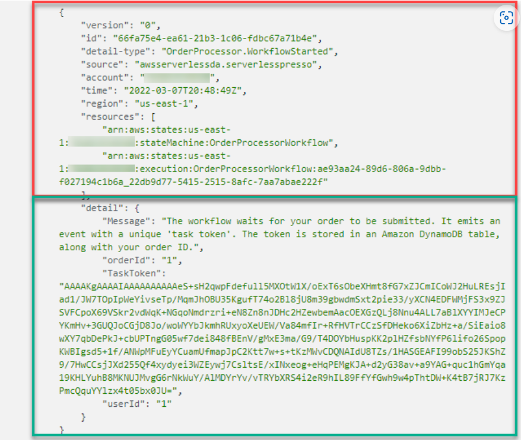

## Workshop Serverlesspresso

Utilize para prática completa:
[Link Workshop](https://workshop.serverlesscoffee.com/)

Neste workshop foi feito um sistema de uma cafeteria utilizandos serviços AWS serverless

**Como funciona a cafeteria?**

- Haverá monitores que apresentaram QR codes que mudam a cada 5 minutos. Clientes utilizam seus celulares para scanear o QR code para realizar seus pedidos. Cada QR code suporta 10 bebidas num período de 5 minutos
- O cliente faz seu pedido na aplicação web carregada pelo QR code. O backend valida o pedido, cria o número do pedido e torna-o disponível para o barista
- O barista recebe os pedidos em seu aplicativo. Eles podem atualizar o status de cada pedido indicando se está sendo preparado, está pronto para entrega ou se foi cancelado
- Os clientes podem ver todas as atualizações dos baristas em seus dispositivos. Os monitores também mostram os status de cada bebida em preparo ou concluída
  
**Estrutura da Aplicação**

Frontend:
- Display app: Usado nos monitores para fornecer o QR code para os clientes além do status em tempo real de cada pedido
- Barista app: Usado pelos baristas para receber novos pedidos e atualizar o status de cada um. As atualizações feitas aqui são propagadas para os demais aplicativos.
- Ordering app: Usado pelos consumidores para realizar seus pedidos em seus dispositivos móveis.

Backend:

A arquitetura da aplicação utiliza **AWS Step Functions**, **Amazon EventBridge**, **AWS Lambda**, **Amazon API Gateway**,**Amazon S3**, **Amazon DynamoDB** e **Amazon Cognito**

JavaScript é executado nas aplicações frontend de browser enviando e recebendo dados da API backend construida usando API Gateway. O DynamoDB fornece uma cada de persistência de dados que é utilizado pela API. Eventos são roteados para o frontend usandoAWS IoT Core e Lambda.


**Atenção**

É fornecido um processo de setup com todos os arquivos base para construção do workshop, porém é necessário ressaltar que haverão custos de utilização dos serviços. ([Link Setup](https://workshop.serverlesscoffee.com/0-setup/1-self-hosted.html))


## OrderProcessorWorkflow

Utilizando o AWS Step Functions foi criada uma nova máquina de estados chamada OrderProcessorWorkflow

O funcionamento seguiria os seguintes passos:
- Primeiro verifica-se com o DynamoDB GetItem se a loja está aberta, ou seja, apta a receber pedidos
- Com um Choice State direcionariamos o fluxo para o fim caso estivesse fechada
- Em caso de estar aberta é verificado se ela comporta mais pedidos. Utiliza-se AWS Step Functions ListExecutions para verificar quantos Workflows estão abertos (máximo estabelecido é 10)
- A saída do estado anterior mantém as informações de input do início do workflow para garantir os dados referentes a loja em questão
- Com Choice State separariamos os casos positivos e negativos
- Com um EventBridge PutEvents o workflow é parado em espera do input do cliente, ou seja, em espera de uma callback.
- Aqui também é estabelecido um tempo para Timeout caso o cliente não faça seu pedido em determinado período de tempo _(Error Handling)_.
- O timeout é redirecionado para um Pass State que adicionara a mensagem do erro e manterá o input original no output usando o ResultPath

**JSON parâmetro para EventBridge**
```JSON
{
  "Entries": [
    {
      "Detail": {
        "Message": "The workflow waits for your order to be submitted. It emits an event with a unique 'task token'. The token is stored in an Amazon DynamoDB table, along with your order ID.",
        "TaskToken.$": "$$.Task.Token",
        "orderId.$": "$.detail.orderId",
        "userId.$": "$.detail.userId"
      },
      "DetailType": "OrderProcessor.WorkflowStarted",
      "EventBusName": "Serverlesspresso",
      "Source": "awsserverlessda.serverlesspresso"
    }
  ]
}
```


- Com a loja aberta e capacidade de receber pedidos utilizamos então o DynamoDB UpdateItem para estabelecer um número de pedido para o input do cliente

**Exemplo de Código Update**
```JSON
{
  "TableName": "serverlesspresso-counting-table",
  "Key": {
    "PK": {
      "S": "orderID"
    }
  },
  "UpdateExpression": "set IDvalue = IDvalue + :val",
  "ExpressionAttributeValues": {
    ":val": {
      "N": "1"
    }
  },
  "ReturnValues": "UPDATED_NEW"
}
```
**Modelo de Output do estado**
;

- Seguindo o fluxo positivo outro EventBridge PutEvents será utilizado para esperar agora as ações do barista
- Novamente com a opção de Timeout caso o barista demore para preparar o pedido e um Pass State para registrar a mensagem de erro
- Ambos os Timeouts são direcionados a um EventBridge PutEvents para emitir o evento Timeout dessa vez sem a espera de um callback
- **Nota:** as callbacks podem ser realizadas por console para teste utilizando o CloudShell por exemplo utiliza-se:
>`aws stepfunctions send-task-success  --task-output '{"orderId":1}' --task-token YOUR_TASK_TOKEN`
 
_YOUR_TASK_TOKEN é adquirido pelo workflow no estado de esperado do input do cliente_

- Posteriormente mais um EventBridge PutEvents é utilizado seguindo o fluxo sem erros para emitir o evento de pedido finalizado
- Para os casos de loja fechada e falta de capacidade colocamos mais um EventBridge PutEvents para sinalizar que a loja não está pronta sem espera por callback

**Modelo JSON**
```JSON
{
  "Entries": [
    {
      "Detail": {
        "Message": "The Step functions workflow checks if the shop is open and has capacity to serve a new order by invoking a Lambda function that queries the Shop config service. The shop was not ready, and so a 'not ready' event is emitted to cancel the current order.",
        "userId.$": "$.detail.userId"
      },
      "DetailType": "OrderProcessor.ShopUnavailable",
      "EventBusName": "Serverlesspresso",
      "Source": "awsserverlessda.serverlesspresso"
    }
  ]
}
```
- Para fim de testes inicia-se uma execução do workflow com o seguinte input:
```JSON
{
    "detail": {
      "orderId": "1",
      "userId": "testuser"
    }
}
```

## Roteando Eventos

Eventos na AWS são representados por uma mensagem JSON contendo alguns dados sobre o estado so sistema

Eventos são:
- Fatos
- Imutáveis
- Observáveis: microserviços podem se inscrever em eventos que lhe interessam
- Temporais: o momento que o evento ocorre importa

**Como um evento se parece**


No bloco vermelho o padrão fornecido pela AWS e no verde a parte customizada no ambiente do workshop

Agora é feito o roteamento dos eventos fornecidos pelo Amazon EventBridge para os serviços pertinentes para o funcionamento do sistema
 
- No console do Amazon EventBridge entre em Regras e criar regra
- Criaremos a regra logAll utilizando o Serverlesspresso Event bus
- Para fonte do Event selecione outro e ignore o painel de evento exemplo
- No paintel Event Pattern insira:
```JSON
{
  "source": ["awsserverlessda.serverlesspresso"]
}
```
- Seguindo para a próxima etapa selecionaremos os alvos que receberam os eventos, portanto selecione AWS service e em baixo CloudWatch log group inserindo no campo também servesspressoEventBus
- Finalizando a criação todos os eventos ocorridos durante o funcionamento da cafeteria serão guardados no CloudWatch para fins de monitoramento

Agora criaremos rotas para os eventos **New Order**, **Workflow Started** e **Waiting Completion**

**New Order**

Seguindo o passo a passo anterior utilizando esse JSON:
```JSON
{
  "detail-type": ["Validator.NewOrder"],
  "source": ["awsserverlessda.serverlesspresso"]
}
```
e alvo sendo Step Functions state machine (OrderProcessorWorkflow)

**Workflow Started**

Utilize:
```JSON
{
  "detail-type": ["OrderProcessor.WorkflowStarted"],
  "source": ["awsserverlessda.serverlesspresso"]
}
```
Alvo: Lambda Function (serverlesspresso-backend-WorkFlowStarted...)

**Waiting Completion**
Utilize:
```JSON
{
  "detail-type": ["OrderProcessor.WaitingCompletion"],
  "source": ["awsserverlessda.serverlesspresso"]
}
```
Alvo: Lambda Function (serverlesspresso-backend-WaitingCompletion...)

Para fins de teste siga o [Link do workshop](https://workshop.serverlesscoffee.com/2-events/7-testing-both-workflows.html)  para mais detalhes

## Frontend

O microsserviço do Publisher recebe eventos por meio de regras do EventBridge e os encaminha para tópicos no AWS IoT Core. Os frontends são configurados para ouvir os tópicos apropriados


São os seguintes tópicos:
- Admin: relacionados a aplicações de administrador (Barista e Display)
- User: aplicativo do consumidor
- Config: todos os aplicativos se inscrevem nesse tópico para receber as mudanças realizadas nas configurações do sistema como menu e estado de armazenamento
  
Há três funções do Lambda e três regras do EventBridge, cada uma publicando em um tópico separado, e elas foram implantadas durante a instalação (Setup).

## Advanced

[Advanced](https://workshop.serverlesscoffee.com/4-advanced.html)


## Cleanup

Utilize as instruções do link para melhor direcionamento

[Workshop Cleanup](https://workshop.serverlesscoffee.com/9-cleanup.html)

## Código do GitHub

[GitHub](https://workshop.serverlesscoffee.com/99-the-code.html)